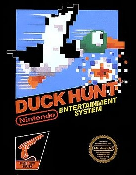
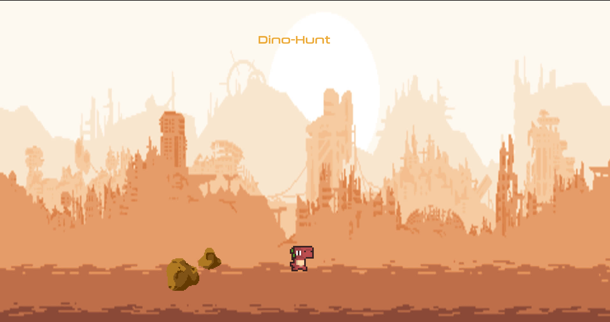
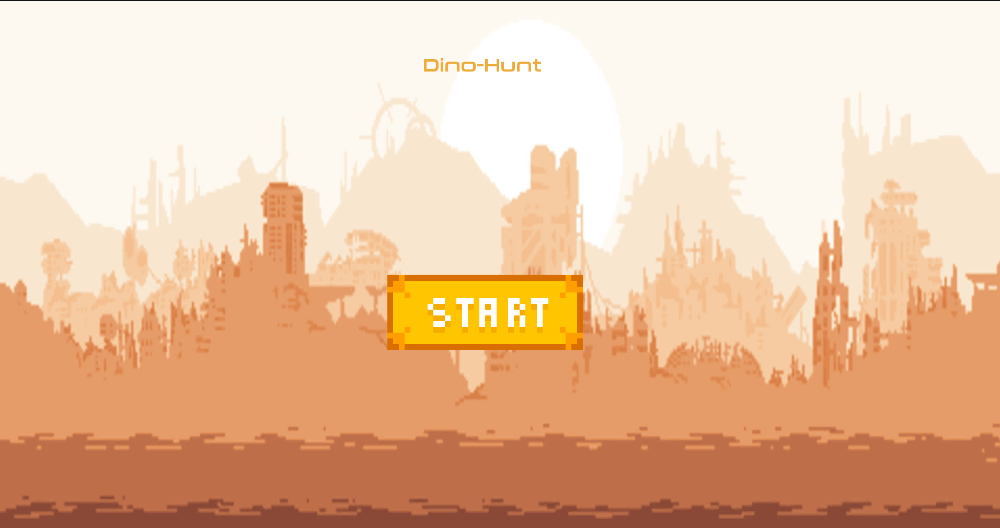
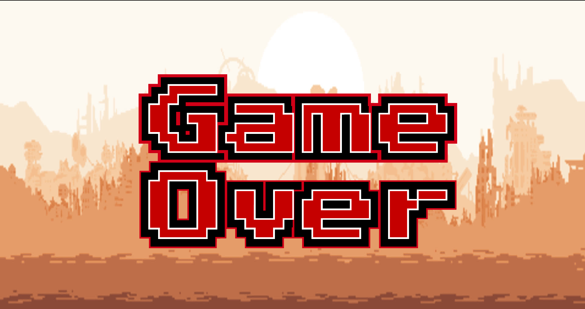
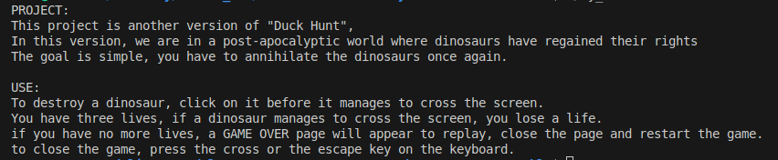

# <ins><i>My_Hunter</ins></i>
## by Rosa Carvalho

### The Projet:

This projet is a graphical projet of <b>EPITECH</b> This project is another version of <b>"Duck Hunt"</b>, 

In this version, we are in a post-apocalyptic world where dinosaurs have regained their rights The goal is simple, you have to annihilate the dinosaurs once again. 

in this project we have a <b>menu</b>:

and a<b> Game Over </b>page:

if after the executable I am given <b>the flag (-h)</b> a short description of the project appears:

a system of life, score and levels is put in place, 
in total we have <b>3 life</b> if a <b>dino </b>manages to <b>cross the screen, you lose a life</b>. For every <b>dino destroyed</b> we win <b>1 point</b> every <b>5 points</b> you gain <b>1 level</b> To destroy a dino,<b> click</b> on it before it manages to cross the screen the mouse cursor is a meteorite you have to destroy the dinos
in this project there is also <b>music and sounds </b>when a dino is exterminated . it's up to you to discover it

### How to use it

the project is compiled using a <b>Makefile</b>, to compile you have to write <b>"make" </b>in the terminal and then write <b>"./my_hunter"</b> (the executable) if you want to see the short description you have to mark <b>"-h"</b> after the executable.

#### <a>Happy Dino Extermination</a>
